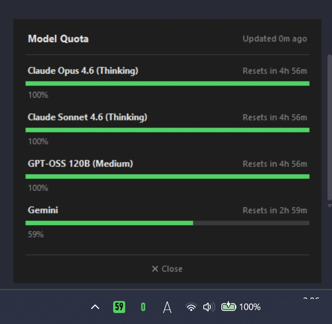

# Antigravity Usage Monitor

<p align="center">
  
</p>

Antigravity（Geminiエディタ）のバックグラウンドで稼働している Language Server と通信し、現在使用しているAIモデルのクオータ（残量）を Windows のタスクトレイにリアルタイムで表示するユーティリティアプリです。

## ✨ 特徴
* **リアルタイム監視**: タスクトレイアイコンに現在選択中のモデルの残量（%）を分かりやすい色分け（緑・黄・赤）と数字で直接表示します。
* **モデル一覧ポップアップ**: タスクトレイアイコンをクリック（またはホバー）することで、利用可能な全モデルの残量を一覧表示できます（Geminiモデルはスッキリと1つに統合表示）。
* **安全設計**: 契約情報などのセンシティブなデータは取得せず、モデルの利用残量のみを取得するため、セキュリティソフトの過剰なヒューリスティック検知を防ぎます。

### 📷 実際の動作画面
<p align="center">
  
</p>

## 📦 動作環境
* Windows 10 / 11
* Python 3.10 以上
* Antigravity エディタ（Language Server がローカルで稼働していること）

## 🚀 インストール方法

### 1. リポジトリのクローンと依存関係のインストール
```bash
git clone https://github.com/your-username/AntigravityUsageMonitor.git
cd AntigravityUsageMonitor
pip install -r requirements.txt
```

### 2. アプリの起動
以下のいずれかの方法で起動してください。

* **方法A: 実行ファイル（.exe）のビルド（推奨）**
  PyInstaller を使用して単一の `.exe` ファイルを作成することが可能です。
  ```bash
  powershell -ExecutionPolicy Bypass -File build.ps1
  ```
  生成された `dist/AntigravityUsageMonitor.exe` を実行してください。（※ 環境によってはセキュリティソフトにブロックされる場合があります。その場合は方法Bをご利用ください）

* **方法B: Pythonから直接起動**
  ```bash
  pythonw monitor.py
  ```

## 🛠️ 仕様・仕組みについて
本アプリは `psutil` を使用して、稼働中の `language_server.exe` のプロセスと起動引数（CSRFトークン）を特定し、ローカルの内部API（`127.0.0.1`）に対して `GetUserStatus` リクエストを送信することでモデルのクオータを取得しています。
取得したデータ内の `cascadeModelConfigData.clientModelConfigs` をパースし、各モデルの残量を計算しています。

## 📜 ライセンス
MIT License
